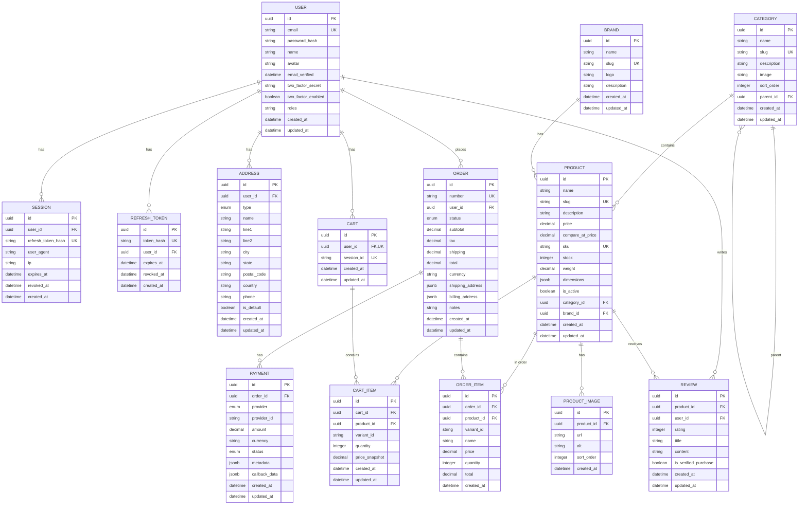
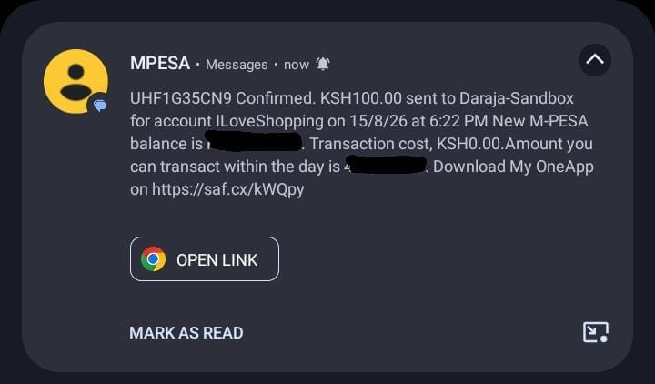

# i-love-shopping

B2C E-commerce Platform for the Kenyan market, built with a **Next.js 14 storefront**, a **Spring Boot 3 API**, PostgreSQL, Redis, RabbitMQ, M-Pesa Daraja and Stripe integrations.

## Table of Contents

- [Overview](#overview)
- [Architecture](#architecture)
- [Entity Relationship Diagram](#entity-relationship-diagram)
- [Technology Stack](#technology-stack)
- [Features](#features)
- [Prerequisites](#prerequisites)
- [Getting Started (Development)](#getting-started-development)
- [Quick Start with the Setup Script](#quick-start-with-the-setup-script)
- [Running Manually](#running-manually)
- [What Runs Where](#what-runs-where)
- [Verify Everything Works](#verify-everything-works)
- [Configuration](#configuration)
- [API Documentation](#api-documentation)
- [Testing](#testing)
- [Docker Deployment](#docker-deployment)
- [Project Structure](#project-structure)
- [Security](#security)
- [License](#license)

## Overview

i-love-shopping is a full-featured B2C e-commerce platform designed for the Kenyan market. It provides a complete shopping experience from product discovery to checkout with M-Pesa integration, user authentication with 2FA support, and admin management capabilities.

### Key Highlights

- **M-Pesa Daraja Integration** - Full STK Push payment flow with callback handling
- **JWT Authentication** - Access/refresh tokens with rotation and revocation
- **Two-Factor Authentication** - TOTP-based 2FA with Google Authenticator support
- **CAPTCHA Protection** - Google reCAPTCHA v3 integration
- **OAuth2 Login** - Google and GitHub OAuth2 support
- **Product Catalog** - Categories, brands, faceted search, filtering, sorting
- **Shopping Cart** - Session and user-based carts with stock validation
- **Order Management** - Complete checkout flow with order tracking
- **Admin Dashboard** - Product, category, brand, order management

## Architecture

The application follows a modular monolith architecture with clean separation of concerns:

```
┌──────────────────────┐      ┌────────────────────────────────────────────────┐
│   Next.js Frontend    │ HTTP │            Spring Boot Application              │
│   localhost:3000      │─────▶│                localhost:8080/api/v1            │
│  customer + admin UI  │ CORS ├────────────────────────────────────────────────┤
└──────────────────────┘      │  Controllers  │ Services  │ Repositories        │
                              ├────────────────────────────────────────────────┤
                              │     Security Layer (JWT, OAuth2, 2FA)           │
                              ├────────────────────────────────────────────────┤
                              │ PostgreSQL │ Redis │ RabbitMQ │ Email (SMTP)    │
                              └───────────────┬───────────────────┬─────────────┘
                                              │                   │
                                     ┌────────▼────────┐  ┌───────▼──────────┐
                                     │ M-Pesa Daraja   │  │ Stripe           │
                                      │ (sandbox)       │  │ Stripe cards     │
                                     └─────────────────┘  └──────────────────┘
```

Order state flows through RabbitMQ: checkout publishes `order.created`, successful payments publish `order.paid`, and a consumer updates the order to CONFIRMED and triggers the confirmation email.

### Module Structure

| Module | Responsibility |
|--------|----------------|
| `auth` | User registration, login, JWT tokens, OAuth2, 2FA, CAPTCHA |
| `catalog` | Products, categories, brands, search, filtering |
| `cart` | Shopping cart management |
| `orders` | Checkout, order management, order history |
| `payments` | M-Pesa STK Push, callbacks, payment status |
| `users` | Profile management, addresses, password changes |
| `reviews` | Product reviews and ratings |

## Entity Relationship Diagram



## Technology Stack

### Backend
- **Java 21** - Language
- **Spring Boot 3.3.x** - Framework
- **Spring Security 6** - Authentication & Authorization
- **Spring Data JPA** - Database ORM
- **Spring AMQP** - RabbitMQ integration for order events
- **Spring Web** - REST API
- **Spring Mail + Thymeleaf** - Transactional emails (verification, password reset, order confirmation, 2FA codes)
- **Flyway** - Database migrations
- **Hibernate** - JPA Provider
- **PostgreSQL 16** - Primary Database
- **Redis 7** - Caching & Sessions
- **RabbitMQ 3** - Message queue for order/payment events
- **JJWT (0.12.5)** - JWT Token handling
- **M-Pesa Daraja API** - Mobile payments (sandbox/production)
- **Stripe** - Card payments (test/live mode)
- **Stripe** - Card payments (test/live mode)
- **Google reCAPTCHA** - Bot protection
- **Lombok** - Boilerplate reduction

### Frontend
- **Next.js 14 (App Router)** - React framework
- **TypeScript** - Type safety
- **Tailwind CSS** - Styling with Outfit typeface
- **react-icons** - Icon set (no emojis)
- **react-hot-toast** - Notifications
- All runtime values are injected via `NEXT_PUBLIC_*` environment variables (see [Configuration](#configuration)) - nothing is hardcoded

### Build & Deployment
- **Maven** (with wrapper) - Backend build tool
- **Docker + Docker Compose** - Containerization for backend, frontend and all dependencies

## Features



### Authentication & Security
- ✅ Email/password registration with email verification
- ✅ JWT access tokens (15 min) + refresh tokens (7 days)
- ✅ Refresh token rotation (single-use)
- ✅ Token revocation (logout, password change, admin action)
- ✅ OAuth2 login (Google, GitHub)
- ✅ TOTP-based 2FA (Google Authenticator compatible)
- ✅ Google reCAPTCHA v3 on registration
- ✅ Password reset via email
- ✅ BCrypt password hashing (cost 12)
- ✅ CORS configuration
- ✅ Helmet-style security headers
- ✅ Rate limiting on auth endpoints

### Product Catalog
- ✅ Hierarchical categories with unlimited depth
- ✅ Brand management
- ✅ Product CRUD with images
- ✅ Stock tracking with atomic decrement/increment
- ✅ Sale pricing with compare-at price
- ✅ Weight & dimensions (metric/imperial)
- ✅ Full-text search on name & description
- ✅ Faceted filtering (category, brand, price, stock, sale)
- ✅ Sorting (relevance, price, newest, rating)
- ✅ Search suggestions/autocomplete
- ✅ Similar products recommendations
- ✅ Pagination with cursor support

### Shopping Cart
- ✅ User carts (authenticated)
- ✅ Guest carts (session-based)
- ✅ Quantity validation against stock
- ✅ Price snapshots (protects against price changes)
- ✅ Variant support
- ✅ Cart merging on login

### Orders & Checkout
- ✅ Multi-step checkout (shipping/billing addresses)
- ✅ Address book with default addresses
- ✅ Tax calculation (configurable rate)
- ✅ Shipping calculation (free over threshold)
- ✅ Order number generation (prefix + timestamp + random)
- ✅ Order status workflow (PENDING → CONFIRMED → PROCESSING → SHIPPED → DELIVERED)
- ✅ Order cancellation (before processing)
- ✅ Order history with pagination

### M-Pesa Payments

- ✅ C2B Payments
- ✅ STK Push initiation
- ✅ Callback processing (success/failure/timeout)
- ✅ Payment status polling
- ✅ Retry failed payments
- ✅ Payment metadata storage

### Card Payments (Stripe)
- ✅ Stripe PaymentIntent create + confirm (test/live mode)
- ✅ Stripe webhook handling (`payment_intent.succeeded`, `payment_intent.payment_failed`)
- ✅ Test card: Stripe `4242 4242 4242 4242`
- ✅ No card data ever touches the server - PCI-friendly tokenized flow
- ✅ Failure scenarios: declined cards, gateway errors, invalid payment IDs

### Messaging & Async Processing
- ✅ RabbitMQ topic exchange `order.events` with durable queues
- ✅ `order.created` published at checkout, `order.paid` on successful payment, `order.cancelled` on cancellation
- ✅ Consumer updates order state (PENDING → CONFIRMED) and triggers confirmation emails
- ✅ Retry with exponential backoff on the listener container

### Frontend (Next.js)
- ✅ Home page with featured products and category tiles
- ✅ Product listing with faceted filters (category, brand, price, stock, sale), sorting and pagination
- ✅ Product detail page with image gallery, similar products and reviews
- ✅ Cart page with real-time totals, quantity updates and free-shipping threshold
- ✅ Single-page checkout: address form + payment method selection (M-Pesa, Stripe card)
- ✅ Order success page and order history
- ✅ Auth pages: login, register, forgot password
- ✅ Account area: profile, addresses book, password change
- ✅ Admin area (role-gated): dashboard, orders, products, categories, brands
- ✅ Search autocomplete in the header, responsive layout, toast notifications
- ✅ Loading skeletons, empty states and inline error states throughout

### User Management
- ✅ Profile updates (name, avatar, email)
- ✅ Email change with re-verification
- ✅ Password change with session invalidation
- ✅ Address book (shipping/billing)
- ✅ Default address per type
- ✅ Order history with totals
- ✅ Product reviews (1-5 stars, verified purchase badge)

### Admin Features
- ✅ Role-based access control (USER, ADMIN, MODERATOR)
- ✅ Product/Category/Brand management
- ✅ Order status updates
- ✅ User management

## Beyond the Brief (Additional Features)

These go beyond the core requirements - added for real-world polish:

### Payments
- **Two payment rails at checkout** - M-Pesa Daraja (mobile money) and card via Stripe, both selectable in a single payment step. (Flutterwave/Airtel entries were removed: enum-only placeholders with no implementation. Stripe covers Visa/Mastercard worldwide including Kenya; M-Pesa covers mobile money.)
- **Real M-Pesa Daraja** - STK push via Safaricom sandbox/production. Configure keys in `.env`. Callback polling fallback for local dev.
- **STK expiry watchdog** - Safaricom phone prompts last ~60–120s. A scheduled job (`MPESA_STK_TIMEOUT_SECONDS`, default 120) auto-marks unanswered STK sessions FAILED so orders never get stuck.
- **Pay-later invoices** - every unpaid order triggers a payable invoice email (`/checkout?retry=ORDER-NUMBER`); fresh invoices are re-sent on every failed/expired payment. Customers can leave mid-payment and resume anytime.
- **Unpaid order self-service** - customers can retry payment (PENDING/EXPIRED/CANCELLED with stock re-check), cancel (restores stock + cart), or permanently delete unpaid orders from their account.
- **Client-side card validation** - Luhn check, expiry and CVV validation happen in the browser before any request; card data is never sent to or stored on our servers.

### Security & reliability
- **Encryption at rest** - order shipping/billing addresses and payment metadata/callback records are encrypted with AES-256-GCM (`DATA_ENCRYPTION_KEY`). Raw database rows are ciphertext; authorised API readers receive transparently decrypted values.
- **Dead-letter queue** - RabbitMQ order queues dead-letter to `order.dead-letter` after exhausted retries, so failed messages are never silently dropped.
- **Per-IP rate limiting** on authentication and API traffic.
- **CORS lockdown** - the API echoes only explicitly configured origins (`CORS_ALLOWED_ORIGINS`); no wildcard-with-credentials.
- **JWT aligned to spec** - 15-minute access tokens, 7-day refresh tokens with single-use rotation and reuse detection.

### Auth & email extras (not in the brief)
- **Working email verification** - persisted single-use tokens (24h), `GET /auth/verify-email`, plus `POST /auth/resend-verification` which reuses a still-valid link.
- **Working password reset** - persisted single-use tokens (1h), session invalidation on reset, no account enumeration.
- **Real Gmail sender** - transactional mail goes through Gmail SMTP (`MAIL_*` in `.env`); MailHog remains a one-block dev toggle.
- **Payable invoice emails** - itemised invoice with a Pay-now link on every unpaid order and every failed/expired payment.
- **Printable invoice & receipt documents** - every order has a print-optimised invoice (`/account/orders/NUMBER/invoice`, with amount due and pay instructions); paid orders additionally get a receipt (`/account/orders/NUMBER/receipt`) with a PAID stamp and full payment details (provider, amount, reference, date). Both print to PDF straight from the browser.
- **Paid confirmation with payment details** - provider, amount paid and a formatted delivery address (never raw JSON or ciphertext).
- **2FA that actually verifies** - setup persists the QR secret; enable checks the code against it.
- **API slice tests** - MockMvc coverage for auth routing/validation alongside the unit suite.

### Storefront & admin experience
- **Multi-currency display** - KES base with USD, EUR, GBP, TZS, UGX and ZAR via a header switcher; rates are env-configurable (`NEXT_PUBLIC_CURRENCY_RATES`) and payments always settle in KES, stated clearly at checkout.
- **Admin analytics dashboard** - collected revenue vs awaiting-payment vs cancellations/refunds ("losses"), average order value, 7-day revenue chart, orders-by-status distribution, best sellers, low-stock watchlist and latest orders.
- **Offers engine** - launch bulk percentage promotions scoped to everything, a category or a brand, with live-offers tracking and one-click end-all.
- **User account dashboard** - KPI cards, recent orders, quick actions; profile and security live under Settings.
- **Guest checkout end-to-end** - visitors can buy without an account; orders attach to their session cart cookie.
- **Port-conflict-aware dev script** - every service auto-shifts to the next free port when defaults are taken. Docker daemon auto-starts on macOS, Windows and Linux if it is not already running.

## Prerequisites

The project needs **Docker** for the database, cache, queue and mail services. Optionally **Java 21 + Maven** and **Node.js 20+** if you want to run the API or frontend directly on your machine.

| Tool | Required for | Notes |
|------|--------------|-------|
| **Docker** + **Docker Compose** | Everything (option 1 & 2) | Runs PostgreSQL 16, Redis 7, RabbitMQ 3 and Mailhog |
| **Java 21** (JDK) | Running the API locally (option 2) | Required for `spring-boot:run` |
| **Maven 3.9+** | Running the API locally (option 2) | The included `./mvnw` wrapper works if Maven is not installed |
| **Node.js 20+** | Running the frontend locally (option 2) | Option 1 runs the frontend inside Docker instead |

> **No setup script?** If you follow the manual commands below instead of using `scripts/dev.sh`, you are responsible for installing the prerequisites yourself.

### External Services (Required for Full Functionality)
- **M-Pesa Daraja API** credentials (Consumer Key, Secret, Shortcode, Passkey)
- **Google reCAPTCHA** (Site Key, Secret Key)
- **Google OAuth2** (Client ID, Secret) - OAuth2 login stays disabled when unset
- **GitHub OAuth2** (Client ID, Secret) - OAuth2 login stays disabled when unset
- **SMTP Server** for emails (Mailhog for development)

> Payment providers are optional. The app starts without any payment keys — configure one or more in your `.env` file as needed. See `docs/setup/PAYMENT-SETUP-GUIDE.md` for setup instructions.

## Getting Started (Development)

This is a **development** setup, not a production server. Everything runs in the **foreground** so you can watch the logs and press `Ctrl+C` to stop. No background services are started.

There are two ways to run the project. Both use Docker for PostgreSQL, Redis, RabbitMQ and Mailhog; they differ in where the app runs:

| Option | What it does | Requires |
|--------|--------------|----------|
| **1) Everything in Docker** | API **and** frontend run inside Docker containers alongside the dependencies | Only Docker |
| **2) Docker dependencies + local API & frontend** | API and frontend run directly on your machine, dependencies run in Docker | Docker, Java 21, Maven, Node.js 20+ |

### 1. Clone the Repository

```bash
git clone https://gitea.kood.tech/imranshiundu/i-love-shopping1.git
cd i-love-shopping
```

> All Docker commands must be run from the **project root** (`i-love-shopping/`). The Spring Boot API runs from the `backend/` directory.

## Quick Start (Easiest Way)

We have provided a foolproof start script located right at the root of the project. It works on **Linux, macOS and Windows**. Even if you aren't familiar with the terminal, this script will check your environment, **install missing tools automatically**, set up configuration, and get the code running.

**Just open your terminal, ensure you are in the project folder, and run:**

```bash
# For Linux / macOS / Git Bash:
bash start.sh

# For Windows (Command Prompt):
start.cmd

# For Windows (PowerShell):
.\start.cmd
```

The script will:
1. Detect your OS (Linux, macOS, or Windows)
2. Check for Docker — install it if missing, start the daemon if it's not running
3. Check for Java 21+, Maven, and Node.js 18+ — install them if missing
4. Auto-shift busy ports to the next free one
5. Create a `.env` file from the template with generated secrets
6. Start all services and print the URLs

### Flags

| Flag | What it does |
|------|-------------|
| *(no flag)* | Interactive menu — prompts you to choose option 1 or 2 |
| `--auto` | Fully automated — runs option 2 (local backend) with no prompts |
| `--stop` | Stops all services, kills lingering processes, removes containers |

```bash
# One-liner: install everything, no prompts
bash start.sh --auto

# Stop everything when you're done
bash start.sh --stop
```

### Menu options

```
How do you want to run the project?
  1) Everything in Docker (PostgreSQL + Redis + Mailhog + RabbitMQ + API + Frontend) - only Docker
  2) Dependencies in Docker + run API & Frontend locally - requires Docker, Java 21, Maven and Node.js
Choose [1/2]:
```

- **Option 1** starts all services with Docker Compose in the foreground: PostgreSQL, Redis, Mailhog, RabbitMQ, the Spring Boot API and the Next.js frontend. Press `Ctrl+C` to stop everything.
- **Option 2** starts the dependencies in Docker, waits until they are healthy, then starts the API (`backend/`) and the frontend (`frontend/`, with `npm install` on first run). Press `Ctrl+C` to stop both - the script also stops the Docker containers when you exit, so nothing is left running in the background.

The first run downloads dependencies (Docker images / Maven packages / npm packages), so it can take a few minutes.

## Running Manually

If you prefer to run the commands yourself, use the steps below. **Run Docker commands from the project root, the API from `backend/` and the frontend from `frontend/`.**

### Option 1 — Everything in Docker

```bash
# Run from the project root (i-love-shopping/)
docker compose -f docker/docker-compose.yml up
```

This starts six services: `postgres`, `redis`, `mailhog`, `rabbitmq`, `api` and `frontend`. The first build can take several minutes. Press `Ctrl+C` to stop all services.

### Option 2 — Docker dependencies + local API & frontend

**Step 1: Start the dependencies** (from the project root):

```bash
docker compose -f docker/docker-compose.yml up -d postgres redis mailhog rabbitmq
```

Wait until PostgreSQL, Redis and RabbitMQ report `healthy` (`docker compose -f docker/docker-compose.yml ps`).

**Step 2: Run the Spring Boot API** (from the `backend/` directory):

The development containers expose PostgreSQL on port **5433**, Redis on **6380** and RabbitMQ on **5672**, so the API must be pointed at those ports.

```bash
# Run from the backend/ directory
cd backend

export DATABASE_URL='jdbc:postgresql://localhost:5433/iloveshopping?stringtype=unspecified'
export DATABASE_USER=iloveshopping
export DATABASE_PASSWORD=iloveshopping
export REDIS_HOST=localhost
export REDIS_PORT=6380
export RECAPTCHA_SECRET_KEY=dev-test-secret
export RECAPTCHA_SITE_KEY=dev-test-site
export JWT_ACCESS_SECRET=dev-access-secret-min-32-chars-long-for-test
export JWT_REFRESH_SECRET=dev-refresh-secret-min-32-chars-long-for-test
export MAIL_HOST=localhost
export MAIL_PORT=1025
export MAIL_SMTP_AUTH=false
export MAIL_SMTP_STARTTLS=false
export FRONTEND_URL=http://localhost:3000
export CORS_ALLOWED_ORIGINS=http://localhost:3000
export RABBITMQ_HOST=localhost
export RABBITMQ_PORT=5672
export RABBITMQ_USERNAME=iloveshopping
export RABBITMQ_PASSWORD=iloveshopping

./mvnw spring-boot:run
```

Windows (PowerShell):

```powershell
cd backend

$env:DATABASE_URL="jdbc:postgresql://localhost:5433/iloveshopping?stringtype=unspecified"
$env:DATABASE_USER="iloveshopping"
$env:DATABASE_PASSWORD="iloveshopping"
$env:REDIS_HOST="localhost"
$env:REDIS_PORT="6380"
$env:RECAPTCHA_SECRET_KEY="dev-test-secret"
$env:RECAPTCHA_SITE_KEY="dev-test-site"
$env:JWT_ACCESS_SECRET="dev-access-secret-min-32-chars-long-for-test"
$env:JWT_REFRESH_SECRET="dev-refresh-secret-min-32-chars-long-for-test"
$env:MAIL_HOST="localhost"
$env:MAIL_PORT="1025"
$env:MAIL_SMTP_AUTH="false"
$env:MAIL_SMTP_STARTTLS="false"
$env:FRONTEND_URL="http://localhost:3000"
$env:CORS_ALLOWED_ORIGINS="http://localhost:3000"
$env:RABBITMQ_HOST="localhost"
$env:RABBITMQ_PORT="5672"
$env:RABBITMQ_USERNAME="iloveshopping"
$env:RABBITMQ_PASSWORD="iloveshopping"

.\mvnw.cmd spring-boot:run
```

**Step 3: Run the frontend** (in a new terminal, from the `frontend/` directory):

```bash
cd frontend
npm install   # first run only
npm run dev
```

The frontend reads its configuration from `frontend/.env.local` (already set up for local development with the API at `http://localhost:8080/api/v1`).

Press `Ctrl+C` to stop the API/frontend, then stop the containers:

```bash
# Run from the project root
docker compose -f docker/docker-compose.yml down
```

## What Runs Where

| Service | Address | Notes |
|---------|---------|-------|
| Frontend (Next.js) | `http://localhost:3000` | React UI - product browsing, cart, checkout, admin |
| Spring Boot API | `http://localhost:8080/api/v1` | REST API |
| Swagger UI | `http://localhost:8080/api/v1/docs` | Interactive API docs |
| PostgreSQL | `localhost:5433` | Database (container maps 5433 → 5432) |
| Redis | `localhost:6380` | Cache (container maps 6380 → 6379) |
| RabbitMQ | `localhost:5672` / `http://localhost:15672` | Message queue / Management UI (`iloveshopping` / `iloveshopping`) |
| Mailhog SMTP | `localhost:1025` | Catches all outgoing emails |
| Mailhog Web UI | `http://localhost:8025` | Read emails sent by the app |

## Verify Everything Works

```bash
# API health check
curl http://localhost:8080/api/v1/health

# Frontend is up
curl -o /dev/null -w "%{http_code}\n" http://localhost:3000/

# Interactive API documentation
# Open http://localhost:8080/api/v1/docs in your browser
```

### Test Accounts

These accounts are seeded by Flyway migrations and are ready to use:

| Role | Email | Password | What you can do |
|------|-------|----------|-----------------|
| **Administrator** | `admin@iloveshopping.com` | `Admin123!` | Everything, plus `/admin`: dashboard analytics, orders lifecycle, product CRUD, offers engine, customers |
| **Customer** | `user@iloveshopping.com` | `User123!` | Browse, buy, review, manage profile and addresses |

You can also register a brand-new account at `/auth/register` (verification
emails land in Mailhog during development), or go through the entire shopping,
checkout and payment journey as a **guest** - no account needed until after
you have paid.

> These credentials are for local development and reviewer environments only.
> Never ship seeded passwords to production.

Then open **http://localhost:3000** in your browser and:

1. Browse products, filter by category/brand/price on `/products`
2. Switch the display currency from the globe icon in the header
3. Add items to the cart and watch totals update in real time
4. Log in as `admin@iloveshopping.com` / `Admin123!` and place an order through checkout with the card option
5. Watch the order flip from PENDING to CONFIRMED in `/account/orders`, then check the confirmation email at http://localhost:8025 (Mailhog)
6. Visit `/admin` for the dashboard, orders, products, categories and brands management

## Configuration

### Application Profiles

| Profile | Description |
|---------|-------------|
| `development` | Default local profile. Connects to PostgreSQL on `localhost:5432` and Redis on `localhost:6379` |
| `test` | Testcontainers-based integration tests |
| `docker` | Used inside Docker Compose. Connects to the `postgres` and `redis` services over the compose network |

> When the API runs locally against the development containers, use `DATABASE_URL` pointing at port **5433** and `REDIS_PORT=6380` (see [Running Manually](#running-manually)).

### Key Backend Properties

```yaml
# Database
spring.datasource.url: jdbc:postgresql://localhost:5432/iloveshopping
spring.datasource.username: iloveshopping
spring.datasource.password: ${DATABASE_PASSWORD}

# JWT
security.jwt.access-secret: ${JWT_ACCESS_SECRET}
security.jwt.refresh-secret: ${JWT_REFRESH_SECRET}
security.jwt.access-expiry-minutes: 15
security.jwt.refresh-expiry-days: 7

# RabbitMQ (order events)
spring.rabbitmq.host: ${RABBITMQ_HOST:localhost}
spring.rabbitmq.port: ${RABBITMQ_PORT:5672}
spring.rabbitmq.username: ${RABBITMQ_USERNAME}
spring.rabbitmq.password: ${RABBITMQ_PASSWORD}

# Mail (set MAIL_SMTP_AUTH=false for Mailhog)
spring.mail.host: ${MAIL_HOST}
spring.mail.port: ${MAIL_PORT}
spring.mail.properties.mail.smtp.auth: ${MAIL_SMTP_AUTH:true}
spring.mail.properties.mail.smtp.starttls.enable: ${MAIL_SMTP_STARTTLS:true}

# Encryption at rest (order addresses, payment records)
app.data-encryption-key: ${DATA_ENCRYPTION_KEY}

# M-Pesa (set your keys in .env)
mpesa.environment: ${MPESA_ENVIRONMENT:sandbox}
mpesa.consumer-key: ${MPESA_CONSUMER_KEY:}
mpesa.consumer-key: ${MPESA_CONSUMER_KEY}
mpesa.consumer-secret: ${MPESA_CONSUMER_SECRET}
mpesa.shortcode: ${MPESA_SHORTCODE}
mpesa.passkey: ${MPESA_PASSKEY}
mpesa.callback-url: ${MPESA_CALLBACK_URL}

# Rate Limiting
security.rate-limit.auth-requests-per-minute: 10
security.rate-limit.api-requests-per-minute: 100

# Commerce rules
app.default-currency: KES
app.tax-rate: 0.16
app.free-shipping-threshold: 5000
```

### Frontend Environment Variables (`frontend/.env.local`)

Every value in the frontend is configurable - no hardcoded URLs, prices or identity strings. All variables use the `NEXT_PUBLIC_` prefix:

| Variable | Default (dev) | Purpose |
|----------|---------------|---------|
| `NEXT_PUBLIC_API_URL` | `http://localhost:8080/api/v1` | Backend API base URL |
| `NEXT_PUBLIC_APP_NAME` | `i-love-shopping` | Brand name shown in header/footer/metadata |
| `NEXT_PUBLIC_APP_DESCRIPTION` | Kenyan market blurb | Metadata description |
| `NEXT_PUBLIC_APP_URL` | `http://localhost:3000` | Public site URL |
| `NEXT_PUBLIC_SUPPORT_EMAIL` | `support@iloveshopping.com` | Contact email in footer |
| `NEXT_PUBLIC_COMPANY_LOCATION` | `Nairobi, Kenya` | Address line in footer |
| `NEXT_PUBLIC_DEFAULT_COUNTRY` | `KE` | Pre-selected country on address forms |
| `NEXT_PUBLIC_CURRENCY` / `NEXT_PUBLIC_LOCALE` | `KES` / `en-KE` | Currency formatting |
| `NEXT_PUBLIC_FREE_SHIPPING_THRESHOLD` | `5000` | Free shipping above this subtotal |
| `NEXT_PUBLIC_SHIPPING_COST` | `200` | Flat shipping fee below threshold |
| `NEXT_PUBLIC_TAX_RATE` | `0.16` | VAT rate applied at cart/checkout |
| `NEXT_PUBLIC_MIN_PASSWORD_LENGTH` | `8` | Registration/password validation |
| `NEXT_PUBLIC_ALLOWED_IMAGE_HOSTS` | `picsum.photos,images.unsplash.com` | Next.js image allowlist (comma-separated) |
| `NEXT_PUBLIC_FEATURED_PRODUCTS_COUNT` | `8` | Products on the home page |
| `NEXT_PUBLIC_PRODUCTS_PAGE_SIZE` | `12` | Products per listing page |
| `NEXT_PUBLIC_ORDERS_PAGE_SIZE` | `10` | Orders per account page |
| `NEXT_PUBLIC_ADMIN_PAGE_SIZE` | `20` | Rows per admin table |
| `NEXT_PUBLIC_RECAPTCHA_SITE_KEY` / `_ENABLED` | dev bypass | reCAPTCHA integration |
| `NEXT_PUBLIC_STRIPE_PUBLISHABLE_KEY` | (empty) | Stripe publishable key (test or live) |
| `NEXT_PUBLIC_CURRENCY_RATES` | `USD=0.0077,EUR=0.0071,...` | Display-currency conversion rates from KES |

### Multi-Currency Display

The storefront shows prices in **KES by default**. Visitors can switch
currency anytime from the globe icon in the header; the choice persists in
their browser and every price on the site converts instantly.

| Currency | Code | Default rate (from KES) |
|----------|------|-------------------------|
| Kenyan Shilling | `KES` | 1 (base) |
| US Dollar | `USD` | 0.0077 |
| Euro | `EUR` | 0.0071 |
| Pound Sterling | `GBP` | 0.0061 |
| Tanzanian Shilling | `TZS` | 19.8 |
| Ugandan Shilling | `UGX` | 28.3 |
| South African Rand | `ZAR` | 0.14 |

- Rates are display-only estimates set through
  `NEXT_PUBLIC_CURRENCY_RATES=CODE=RATE,CODE=RATE` - plug in live FX rates here.
- **Payments always settle in KES** (M-Pesa and the card gateway
  are Kenyan-shilling rails). Checkout states this clearly whenever a
  non-KES currency is selected, so there is no surprise at the PIN prompt.

> Keep these values in sync with backend `app.tax-rate`, `app.free-shipping-threshold` and `app.default-currency` so cart math matches server-side totals.

## API Documentation

### Interactive Documentation

Swagger UI is available at: `http://localhost:8080/api/v1/docs`

### Core Endpoints

| Method | Endpoint | Description | Auth |
|--------|----------|-------------|------|
| `POST` | `/auth/register` | Register new user | No |
| `POST` | `/auth/login` | Login user | No |
| `POST` | `/auth/refresh` | Refresh access token | No |
| `POST` | `/auth/logout` | Logout & revoke session | Yes |
| `POST` | `/auth/forgot-password` | Request password reset | No |
| `POST` | `/auth/reset-password` | Reset password with token | No |
| `GET` | `/auth/verify-email` | Verify email with token | No |
| `POST` | `/auth/2fa/setup` | Get 2FA secret & QR code | Yes |
| `POST` | `/auth/2fa/enable` | Enable 2FA | Yes |
| `GET` | `/categories` | List all categories | No |
| `GET` | `/categories/{slug}` | Get category by slug | No |
| `GET` | `/brands` | List all brands | No |
| `GET` | `/products` | Search & filter products | No |
| `GET` | `/products/{slug}` | Get product details | No |
| `GET` | `/products/search/suggestions` | Search autocomplete | No |
| `GET` | `/cart` | Get current cart | Yes |
| `POST` | `/cart/items` | Add item to cart | Yes |
| `PATCH` | `/cart/items/{id}` | Update cart item | Yes |
| `DELETE` | `/cart/items/{id}` | Remove cart item | Yes |
| `POST` | `/orders/checkout` | Checkout (create order) | Yes |
| `GET` | `/orders` | List user orders | Yes |
| `GET` | `/orders/{number}` | Get order details | Yes |
| `POST` | `/orders/{number}/cancel` | Cancel order | Yes |
| `POST` | `/orders/payments/mpesa/stk-push` | Initiate M-Pesa payment | Yes |
| `POST` | `/payments/stripe/create-intent` | Create Stripe PaymentIntent | Yes |
| `POST` | `/payments/stripe/confirm` | Confirm Stripe payment | Yes |
| `POST` | `/payments/stripe/webhook` | Stripe webhook handler | No |
| `GET` | `/products/{slug}/reviews` | List product reviews | No |
| `GET` | `/user/profile` | Get user profile | Yes |
| `PUT` | `/user/profile` | Update profile | Yes |
| `POST` | `/user/password` | Change password | Yes |
| `GET` | `/user/addresses` | List addresses | Yes |
| `POST` | `/user/addresses` | Add address | Yes |

### Example Requests

#### Register User

```bash
curl -X POST http://localhost:8080/api/v1/auth/register \
  -H "Content-Type: application/json" \
  -d '{
    "email": "user@example.com",
    "password": "SecurePass123!",
    "name": "John Doe",
    "captchaToken": "recaptcha-token-from-frontend"
  }'
```

#### Login

```bash
curl -X POST http://localhost:8080/api/v1/auth/login \
  -H "Content-Type: application/json" \
  -d '{
    "email": "user@example.com",
    "password": "SecurePass123!"
  }'
```

#### Search Products

```bash
curl "http://localhost:8080/api/v1/products?query=ceramic&minPrice=10&maxPrice=100&sortBy=price_asc&page=0&size=20"
```

#### Add to Cart

```bash
curl -X POST http://localhost:8080/api/v1/cart/items \
  -H "Content-Type: application/json" \
  -H "Authorization: Bearer <access-token>" \
  -d '{
    "productId": "uuid-of-product",
    "quantity": 2
  }'
```

#### Checkout

```bash
curl -X POST http://localhost:8080/api/v1/orders/checkout \
  -H "Content-Type: application/json" \
  -H "Authorization: Bearer <access-token>" \
  -d '{
    "shippingAddress": {
      "name": "John Doe",
      "line1": "123 Main St",
      "city": "Nairobi",
      "state": "Nairobi County",
      "postalCode": "00100",
      "country": "KE",
      "phone": "+254700000000"
    },
    "billingAddress": {
      "name": "John Doe",
      "line1": "123 Main St",
      "city": "Nairobi",
      "state": "Nairobi County",
      "postalCode": "00100",
      "country": "KE"
    }
  }'
```

#### Initiate M-Pesa Payment

```bash
curl -X POST http://localhost:8080/api/v1/orders/payments/mpesa/stk-push \
  -H "Content-Type: application/json" \
  -H "Authorization: Bearer <access-token>" \
  -d '{
    "orderId": "uuid-of-order",
    "amount": "4720.00",
    "phoneNumber": "254712345678",
    "accountReference": "ORD-12345",
    "transactionDesc": "Payment for order ORD-12345"
  }'
```

#### Pay an Order with Stripe Card

```bash
# 1. Create a payment intent
curl -X POST http://localhost:8080/api/v1/payments/stripe/create-intent \
  -H "Content-Type: application/json" \
  -H "Authorization: Bearer <access-token>" \
  -d '{"orderId": "uuid-of-order", "amount": 406.48, "currency": "kes"}'

# 2. Confirm it with the returned paymentIntentId.
#    On success the order moves PENDING -> CONFIRMED via RabbitMQ and a
#    confirmation email is sent (visible in Mailhog at http://localhost:8025).
curl -X POST http://localhost:8080/api/v1/payments/stripe/confirm \
  -H "Content-Type: application/json" \
  -H "Authorization: Bearer <access-token>" \
  -d '{"paymentIntentId": "pi_sim_xxxxxxxxxxxxxxxx"}'
```

> The payment is processed via the configured provider (Stripe). Set up webhooks for real-time status updates.

## Testing

### Run All Tests

```bash
cd backend
./mvnw test
```

### Run Specific Test Classes

```bash
# Unit tests
./mvnw test -Dtest=JwtServiceTest
./mvnw test -Dtest=ProductTest
./mvnw test -Dtest=AuthValidationTest
./mvnw test -Dtest=SecurityTest

# With coverage
./mvnw test jacoco:report
```

### Test Reports

- **Surefire Reports**: `backend/target/surefire-reports/`
- **JaCoCo Coverage**: `backend/target/site/jacoco/index.html`

### Running Tests on Different Operating Systems

#### Linux/macOS

```bash
cd backend

# Run all tests
./mvnw test

# Run specific test class
./mvnw test -Dtest=JwtServiceTest

# Run with coverage report
./mvnw test jacoco:report

# View coverage report
xdg-open target/site/jacoco/index.html  # Linux
open target/site/jacoco/index.html      # macOS
```

#### Windows (PowerShell)

```powershell
cd backend

# Run all tests
.\mvnw.cmd test

# Run specific test class
.\mvnw.cmd test -Dtest=JwtServiceTest

# Run with coverage report
.\mvnw.cmd test jacoco:report

# View coverage report
start target\site\jacoco\index.html
```

#### Windows (Command Prompt)

```cmd
cd backend

REM Run all tests
mvnw.cmd test

REM Run specific test class
mvnw.cmd test -Dtest=JwtServiceTest

REM Run with coverage report
mvnw.cmd test jacoco:report

REM View coverage report
start target\site\jacoco\index.html
```

### Test Reports

- **Surefire Reports**: `backend/target/surefire-reports/`
- **JaCoCo Coverage**: `backend/target/site/jacoco/index.html`

### Test Categories

| Test Class | Category | Description |
|------------|----------|-------------|
| `JwtServiceTest` | Unit | JWT token generation, validation, expiry |
| `AuthValidationTest` | Unit | Input validation for auth DTOs |
| `AuthControllerTest` | API integration | Auth endpoint routing, validation, service delegation |
| `DataEncryptionServiceTest` | Unit | AES-GCM round-trip, idempotency, legacy plaintext compat |
| `ProductTest` | Unit | Product entity business logic |
| `SecurityTest` | Unit | SQL injection, XSS, path traversal detection |
| `HealthCheckTest` | Unit | Health check response structure |

## Docker Deployment

> For local development, use the [Getting Started (Development)](#getting-started-development) instructions instead. This section covers building the images and the production deployment.

The repository ships two compose files:

| File | Purpose |
|------|---------|
| `docker/docker-compose.yml` | **Development** - PostgreSQL, Redis, Mailhog, RabbitMQ, the API and the Next.js frontend with sensible dev defaults |
| `docker/docker-compose.prod.yml` | **Production** - adds Nginx reverse proxy, env-based secrets, no Mailhog |

### Build Images

```bash
# Backend image (Jib)
cd backend
./mvnw compile jib:dockerBuild -Dimage=iloveshopping/backend:latest

# Or build with Docker directly
docker build -t iloveshopping/backend:latest -f Dockerfile .

# Frontend image (multi-stage Node build)
docker build -t iloveshopping/frontend:latest -f frontend/Dockerfile frontend/
```

### Deploy with Docker Compose

```bash
# Production deployment
docker compose -f docker/docker-compose.yml -f docker/docker-compose.prod.yml up -d
```

### Docker Commands on Different Operating Systems

#### Linux/macOS

```bash
# Build and start all services
docker compose -f docker/docker-compose.yml up -d

# View logs
docker compose -f docker/docker-compose.yml logs -f api

# Stop services
docker compose -f docker/docker-compose.yml down

# Build production images
docker compose -f docker/docker-compose.yml -f docker/docker-compose.prod.yml build
```

#### Windows (PowerShell)

```powershell
# Build and start all services
docker compose -f docker\docker-compose.yml up -d

# View logs
docker compose -f docker\docker-compose.yml logs -f api

# Stop services
docker compose -f docker\docker-compose.yml down

# Build production images
docker compose -f docker\docker-compose.yml -f docker\docker-compose.prod.yml build
```

#### Windows (Command Prompt)

```cmd
REM Build and start all services
docker compose -f docker\docker-compose.yml up -d

REM View logs
docker compose -f docker\docker-compose.yml logs -f api

REM Stop services
docker compose -f docker\docker-compose.yml down

REM Build production images
docker compose -f docker\docker-compose.yml -f docker\docker-compose.prod.yml build
```

### Health Checks

```bash
# Check service health
curl http://localhost:8080/api/v1/health

# Detailed health
curl http://localhost:8080/api/v1/health/detailed

# Kubernetes probes
curl http://localhost:8080/api/v1/ready
curl http://localhost:8080/api/v1/live
```

## Project Structure

```
i-love-shopping/
├── backend/
│   ├── src/
│   │   ├── main/
│   │   │   ├── java/com/iloveshopping/
│   │   │   │   ├── config/          # Configuration (RabbitMQ, security beans, properties)
│   │   │   │   ├── controller/      # REST controllers
│   │   │   │   ├── dto/             # Data Transfer Objects
│   │   │   │   ├── entity/          # JPA entities
│   │   │   │   ├── exception/       # Custom exceptions
│   │   │   │   ├── filter/          # Rate limiting filter
│   │   │   │   ├── messaging/       # RabbitMQ publisher & consumers
│   │   │   │   ├── repository/      # Spring Data repositories
│   │   │   │   ├── security/        # JWT, OAuth2, security config
│   │   │   │   ├── service/         # Business logic
│   │   │   │   └── util/            # Utility classes
│   │   │   └── resources/
│   │   │       ├── db/migration/    # Flyway SQL migrations + seed data
│   │   │       ├── application.yml  # Main configuration
│   │   │       └── templates/email/ # Thymeleaf email templates
│   │   └── test/
│   │       └── java/...             # Unit & integration tests
│   ├── Dockerfile
│   ├── pom.xml
│   ├── mvnw / mvnw.cmd              # Maven wrapper (no global Maven needed)
│   └── .env.example
├── frontend/
│   ├── src/
│   │   ├── app/                     # Next.js App Router pages
│   │   │   ├── page.tsx             # Home
│   │   │   ├── products/            # Listing + detail pages
│   │   │   ├── cart/                # Cart
│   │   │   ├── checkout/            # Checkout + success page
│   │   │   ├── auth/                # Login, register, forgot password
│   │   │   ├── account/             # Profile, orders, addresses
│   │   │   └── admin/               # Admin dashboard (role-gated layout)
│   │   ├── components/              # Header, footer, UI primitives
│   │   ├── contexts/                # Auth + cart context
│   │   ├── services/                # API client, cart service
│   │   ├── lib/                     # config.ts (all env vars), utils
│   │   └── types/                   # Shared TypeScript types
│   ├── Dockerfile                   # Multi-stage Node build
│   ├── next.config.js               # API rewrites + image allowlist from env
│   ├── tailwind.config.js           # Outfit font, primary palette, tinted shadows
│   └── .env.local                   # All NEXT_PUBLIC_* configuration (dev defaults)
├── docker/
│   ├── docker-compose.yml           # Dev compose (PostgreSQL, Redis, Mailhog, RabbitMQ, API, frontend)
│   ├── docker-compose.prod.yml      # Production compose (Nginx, no Mailhog)
│   └── nginx/                       # Nginx reverse proxy config
├── scripts/
│   ├── dev.sh                       # Dev setup script (Linux/macOS/Git Bash)
│   ├── dev.cmd                      # Dev setup script (Windows)
│   ├── check-secrets.sh             # Secret scanning helper
│   └── ...
├── start.sh / start.cmd             # One-command entry points (forward to scripts/dev.*)
├── docs/                            # Architecture, deployment, security & API docs
├── .gitignore
└── README.md
```

## Security

### Implemented Security Measures

- **JWT Tokens**: HS256 with 256-bit secrets, short-lived access tokens
- **Refresh Token Rotation**: Single-use, automatic revocation on reuse
- **Password Hashing**: BCrypt with cost factor 12
- **2FA**: TOTP (RFC 6238) with 30-second windows
- **CAPTCHA**: Google reCAPTCHA v3 score-based verification
- **CORS**: Configured allowed origins, credentials support
- **Rate Limiting**: Per-IP limits on auth endpoints
- **Security Headers**: CSP, X-Frame-Options, X-Content-Type-Options
- **Input Validation**: Bean Validation (JSR-380) on all DTOs
- **SQL Injection Prevention**: Parameterized queries via JPA
- **XSS Prevention**: Output encoding, CSP headers

### Security Checklist for Production

- [ ] Rotate JWT secrets regularly
- [ ] Use HTTPS only (configure TLS termination)
- [ ] Set secure cookie flags (`Secure`, `HttpOnly`, `SameSite=Strict`)
- [ ] Configure proper CSP for your frontend domain
- [ ] Enable audit logging for sensitive operations
- [ ] Set up WAF rules for API endpoints
- [ ] Regular dependency vulnerability scanning (`mvn dependency-check`)
- [ ] Configure proper CORS origins (no wildcards)

## License

This project is licensed under the MIT License - see the [LICENSE](LICENSE) file for details.

## Acknowledgments

- [Spring Boot](https://spring.io/projects/spring-boot)
- [M-Pesa Daraja API](https://developer.safaricom.co.ke/)
- [Google reCAPTCHA](https://www.google.com/recaptcha/)
- [JJWT](https://github.com/jwtk/jjwt)
- [MapStruct](https://mapstruct.org/)
- [Testcontainers](https://testcontainers.com/)
- [Flyway](https://flywaydb.org/)