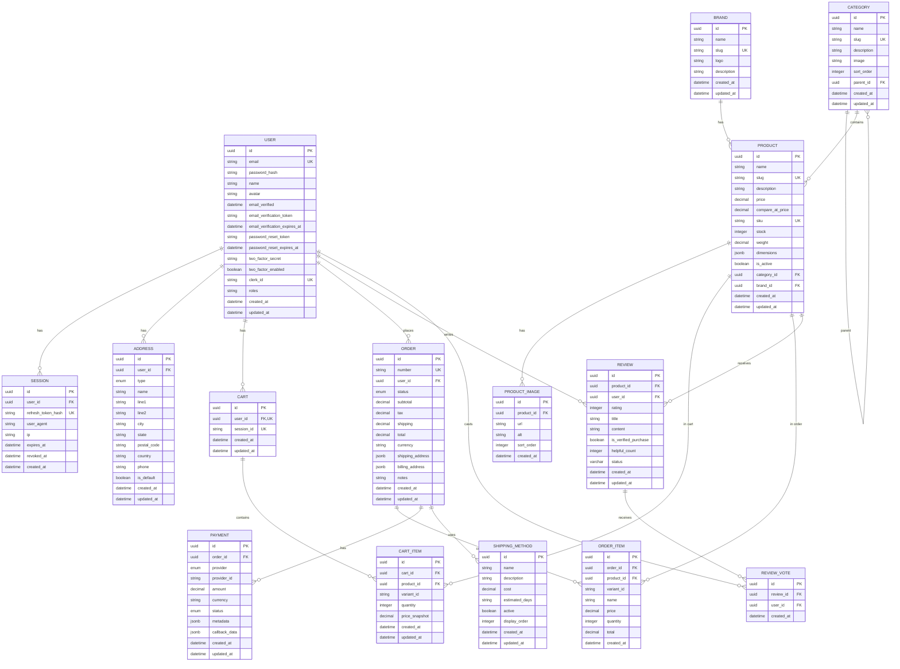

# Architecture

The application follows a modular monolith architecture with clean separation of concerns:

```
┌──────────────────────┐      ┌────────────────────────────────────────────────┐
│   Next.js Frontend    │ HTTP │            Spring Boot Application              │
│   localhost:3000      │─────▶│                localhost:8080/api/v1            │
│  customer + admin UI  │ CORS ├────────────────────────────────────────────────┤
└──────────────────────┘      │  Controllers  │ Services  │ Repositories        │
                              ├────────────────────────────────────────────────┤
                              │     Security Layer (JWT, OAuth2, 2FA)           │
                              ├────────────────────────────────────────────────┤
                              │ PostgreSQL │ Redis │ RabbitMQ │ Email (SMTP)    │
                              └───────────────┬───────────────────┬─────────────┘
                                              │                   │
                                     ┌────────▼────────┐  ┌───────▼──────────┐
                                     │ M-Pesa Daraja   │  │ Stripe           │
                                      │ (sandbox)       │  │ Stripe cards     │
                                     └─────────────────┘  └──────────────────┘
```

Order state flows through RabbitMQ: checkout publishes `order.created`, successful payments publish `order.paid`, and a consumer updates the order to CONFIRMED and triggers the confirmation email.

### Module Structure

| Module | Responsibility |
|--------|----------------|
| `auth` | User registration, login, JWT tokens, OAuth2, 2FA, CAPTCHA |
| `catalog` | Products, categories, brands, search, filtering |
| `cart` | Shopping cart management |
| `orders` | Checkout, order management, order history |
| `payments` | M-Pesa STK Push, callbacks, payment status |
| `users` | Profile management, addresses, password changes |
| `reviews` | Product reviews, helpfulness votes and moderation |
| `review_votes` | One helpful vote per user per review |
| `shipping_methods` | Admin-managed delivery options (Standard/Express/Pickup) |

## Entity Relationship Diagram



## Technology Stack

### Backend
- **Java 21** - Language
- **Spring Boot 3.3.x** - Framework
- **Spring Security 6** - Authentication & Authorization
- **Spring Data JPA** - Database ORM
- **Spring AMQP** - RabbitMQ integration for order events
- **Spring Web** - REST API
- **Spring Mail + Thymeleaf** - Transactional emails (verification, password reset, order confirmation, 2FA codes)
- **Flyway** - Database migrations
- **Hibernate** - JPA Provider
- **PostgreSQL 16** - Primary Database
- **Redis 7** - Caching & Sessions
- **RabbitMQ 3** - Message queue for order/payment events
- **JJWT (0.12.5)** - JWT Token handling
- **M-Pesa Daraja API** - Mobile payments (sandbox/production)
- **Stripe** - Card payments (test/live mode)
- **Stripe** - Card payments (test/live mode)
- **Google reCAPTCHA** - Bot protection
- **Lombok** - Boilerplate reduction

### Frontend
- **Next.js 14 (App Router)** - React framework
- **TypeScript** - Type safety
- **Tailwind CSS** - Styling with Outfit typeface
- **react-icons** - Icon set (no emojis)
- **react-hot-toast** - Notifications
- All runtime values are injected via `NEXT_PUBLIC_*` environment variables (see [Configuration](#configuration)) - nothing is hardcoded

### Build & Deployment
- **Maven** (with wrapper) - Backend build tool
- **Docker + Docker Compose** - Containerization for backend, frontend and all dependencies

## Project Structure

```
i-love-shopping/
├── backend/
│   ├── src/
│   │   ├── main/
│   │   │   ├── java/com/iloveshopping/
│   │   │   │   ├── config/          # Configuration (RabbitMQ, security beans, properties)
│   │   │   │   ├── controller/      # REST controllers
│   │   │   │   ├── dto/             # Data Transfer Objects
│   │   │   │   ├── entity/          # JPA entities
│   │   │   │   ├── exception/       # Custom exceptions
│   │   │   │   ├── filter/          # Rate limiting filter
│   │   │   │   ├── messaging/       # RabbitMQ publisher & consumers
│   │   │   │   ├── repository/      # Spring Data repositories
│   │   │   │   ├── security/        # JWT, OAuth2, security config
│   │   │   │   ├── service/         # Business logic
│   │   │   │   ├── util/            # Utility classes
│   │   │   │   └── validation/      # Address + input validators
│   │   │   └── resources/
│   │   │       ├── db/migration/    # Flyway SQL migrations + seed data (V1..V13)
│   │   │       ├── application.yml  # Main configuration
│   │   │       └── templates/email/ # Thymeleaf emails (verification, reset, invoice, confirmation, 2FA)
│   │   └── test/
│   │       └── java/...             # Unit & integration tests
│   ├── Dockerfile
│   ├── pom.xml
│   ├── mvnw / mvnw.cmd              # Maven wrapper (no global Maven needed)
│   └── .env.example
├── frontend/
│   ├── src/
│   │   ├── app/                     # Next.js App Router pages
│   │   │   ├── page.tsx             # Home
│   │   │   ├── products/            # Listing + detail pages
│   │   │   ├── cart/                # Cart
│   │   │   ├── checkout/            # Checkout + success page
│   │   │   ├── auth/                # Forgot/reset password, verify email (login+register are a global modal)
│   │   │   ├── account/             # Profile, orders (+invoice/receipt documents), addresses
│   │   │   ├── oauth2/redirect/     # OAuth callback (Google/GitHub token handoff)
│   │   │   └── admin/               # Admin dashboard (role-gated layout)
│   │   ├── components/              # Header, footer, UI primitives
│   │   ├── components/auth/         # Sign-in/register modal + host
│   │   ├── contexts/                # Auth + cart context
│   │   ├── services/                # API client, cart service
│   │   ├── lib/                     # config.ts (all env vars), captcha.ts, utils
│   │   └── types/                   # Shared TypeScript types
│   ├── Dockerfile                   # Multi-stage Node build
│   ├── next.config.js               # API rewrites + image allowlist from env
│   ├── tailwind.config.js           # Outfit font, primary palette, tinted shadows
│   └── .env.local                   # All NEXT_PUBLIC_* configuration (dev defaults)
├── docker/
│   ├── docker-compose.yml           # Dev compose (PostgreSQL, Redis, Mailhog, RabbitMQ, API, frontend)
│   ├── docker-compose.prod.yml      # Production compose (Nginx, no Mailhog)
│   └── nginx/                       # Nginx reverse proxy config
├── scripts/
│   ├── dev.sh                       # Dev setup script (Linux/macOS/Git Bash)
│   ├── dev.cmd                      # Dev setup script (Windows)
│   ├── check-secrets.sh             # Secret scanning helper
│   └── ...
├── start.sh / start.cmd             # One-command entry points (forward to scripts/dev.*)
├── docs/                            # Architecture, deployment, security & API docs
├── .gitignore
└── README.md
```
